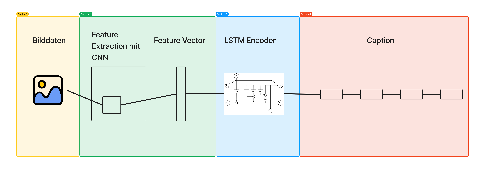

# del-image-captioning

Repository für die Minichallenge 2 des Moduls "Deep Learning" im Bachelorstudiengang "Data Science" an der Fachhochschule Nordwestschweiz (FHNW).

Es wurde versucht die Resultate des Papers von [1] zu reproduzieren. 

# Modellarchitektur

# Beschreibung Repository

Im Notebook *Modellentwicklung.ipynb* ist die explorative Datenanalyse und die Modellentwicklung beschrieben. In einem weiteren Schritt wurde die Modellstruktur ausgelagert in die Datei *img_cap_lib.py*.

Das Notebook *Resulate.ipynb* zeigt die Resultate der verschiedenen Modelle.

Im Ordner *notebooks_for_training* befinden sich die Notebooks, welche zum Training der Modelle verwendet wurde.

Im Ordner *models* befinden sich die Modelle.

Um die Notebooks und Dateien ausführen zu können, muss ein Virtualenvironment erstellt und die Abhängigkeiten installiert werden. Diese sind in der Datei *requirements.txt* aufgelistet.

# Quellen

[1] https://arxiv.org/abs/1411.4555